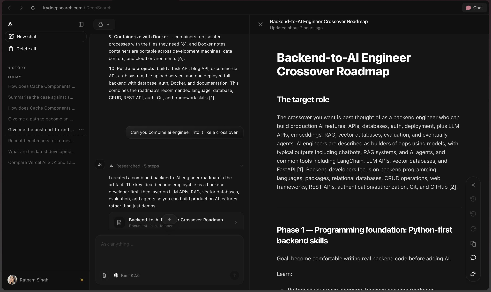
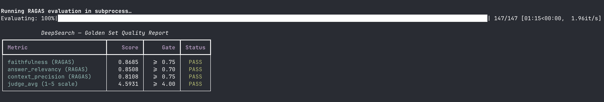

<p align="center">
  <picture>
    <source media="(prefers-color-scheme: dark)" srcset="frontend/public/images/deepsearch-dark.png">
    
  </picture>
</p>

# DeepSearch

A research chatbot that searches the web, scrapes pages, indexes them in a vector store, and writes grounded, cited answers that stream into a side-panel artifact. Every claim in an answer can be traced back to a real source URL.

**Live at [trydeepsearch.com](https://trydeepsearch.com)**



---

## What it does

You type a question. DeepSearch runs a loop:

1. Calls Serper to search Google and get URLs.
2. Opens each URL with headless Chromium and extracts the text.
3. Chunks the text and stores it in a Qdrant vector store.
4. Retrieves the most relevant chunks using hybrid search and a cross-encoder reranker.
5. Feeds the chunks to an LLM (your choice from the dropdown) and streams a grounded, cited answer.
6. Renders the answer as a side-panel artifact with clickable source links.

The LLM is only allowed to state things that are present in the retrieved chunks. If retrieval confidence is too low, the system refuses to answer rather than guessing.

---

## Features

### Agent and retrieval

- **Agentic tool loop** with four tools: `web_search`, `scrape_and_index`, `retrieve_chunks`, and `create_artifact`. The LLM decides which tools to call and in what order.
- **Hybrid search**: dense vectors from `text-embedding-3-small` (1536 dimensions) combined with sparse word-frequency vectors, merged inside Qdrant with Reciprocal Rank Fusion (RRF), then re-ranked with `cross-encoder/ms-marco-MiniLM-L-6-v2`.
- **Confidence gating**: if the highest rerank score after retrieval is below 0.65, the agent returns a refusal message and tries to search and scrape fresh sources before answering.
- **Prompt-injection defence**: all scraped web content is wrapped in `<untrusted_web_content source="...">` XML tags and scanned for 10 known injection patterns before it reaches the LLM context window.
- **Semantic cache**: previous answers are stored in Upstash Redis keyed by query embedding. A new query with cosine similarity >= 0.70 against a cached query gets the cached answer instantly, skipping the full pipeline.

### Models and routing

- **Multi-model dropdown**: GPT-5.5, GPT-5.4 mini, Gemini 3.1 Pro, Gemini 3.0 Flash, Claude Opus 4.7, Claude Sonnet 4.6, Kimi K2.5, DeepSeek V3.2, Grok 4.1. All routed through OpenRouter using the standard OpenAI SDK.
- **Complexity router**: short, simple queries are automatically routed to the flash model (cheap and fast). Longer, multi-hop queries go to the pro model. You can override either with the dropdown.
- **Per-conversation cost tracking**: every chat turn is tagged with a `session_id` and `user_id` so you can see per-conversation LLM cost in the OpenRouter dashboard.

### Streaming and artifacts

- **Live token streaming** via the AI SDK UI Message Stream Protocol. Tokens appear word by word as the model generates them.
- **Side-panel artifacts** in three kinds: `text` (markdown report with headings, bullets, and citations), `code` (syntax-highlighted source), and `sheet` (CSV rendered as a spreadsheet).
- **Auto-promotion**: if the model answers at length but forgets to call `create_artifact`, the backend automatically promotes the streamed answer into a text artifact so the side panel is always populated for substantive responses.
- **Clickable inline citations**: the backend rewrites `[1]`, `[2]` markers in the answer into markdown links and appends a `## Sources` section at the bottom if the model forgot one.

### Auth, history, and storage

- **Clerk authentication** for sign-in, sign-up, and protected routes.
- **Drizzle ORM + Postgres** for storing chat history, messages, and documents.
- **Vercel Blob** for file uploads.
- **IP rate limiting** to prevent abuse.

---

## Architecture

A browser request flows through Next.js on Vercel, which authenticates it with Clerk, saves it to Postgres, and forwards the messages to the FastAPI backend. The backend runs the agent loop, calling OpenRouter for LLM completions and dispatching tool calls to Serper, Playwright, Qdrant, and Redis as needed. Streamed tokens and artifact payloads flow back to the browser in real time.

This diagram shows both the live product path and the offline quality loop that makes the system reliable.

```mermaid
%%{init: {
  "theme": "base",
  "themeVariables": {
    "darkMode": true,
    "background": "#000000",
    "mainBkg": "transparent",
    "primaryColor": "transparent",
    "primaryBorderColor": "#52525B",
    "primaryTextColor": "#E4E4E7",
    "secondaryColor": "transparent",
    "tertiaryColor": "transparent",
    "lineColor": "#71717A",
    "fontFamily": "ui-monospace, SFMono-Regular, Menlo, monospace",
    "fontSize": "13px",
    "clusterBkg": "transparent",
    "clusterBorder": "#3F3F46",
    "edgeLabelBackground": "#000000",
    "titleColor": "#A1A1AA"
  }
}}%%
flowchart LR
    User["User in browser"]

    subgraph frontendLayer [Frontend on Vercel]
        NextApp["Next.js 16 App Router"]
        ClerkAuth["Clerk auth"]
        ChatRoute["API route: /api/chat"]
        UseChat["AI SDK useChat"]
        ModelPicker["Model selector"]
        ArtifactPanel["Side-panel artifact"]
        CitationLinks["Clickable citations"]
        UploadStore["Vercel Blob uploads"]
        DrizzleOrm["Drizzle ORM"]
        ChatHistory["Postgres chat history"]
    end

    subgraph backendLayer [FastAPI backend]
        ChatEndpoint["POST /chat"]
        StreamAdapter["UI message stream adapter"]
        AgentLoop["Agentic tool loop"]
        ModelRouter["Complexity router"]
        ConfidenceGate["Confidence gate"]
        CitationInjector["Sources section injector"]
        PromptGuard["Prompt-injection guard"]
    end

    subgraph modelLayer [Model layer]
        OpenRouter["OpenRouter"]
        ProModel["Pro model for deep research"]
        FlashModel["Flash model for quick answers"]
        UserModel["User-selected model override"]
    end

    subgraph toolLayer [Agent tools]
        WebSearchTool["web_search"]
        ScrapeTool["scrape_and_index"]
        RetrieveTool["retrieve_chunks"]
        ArtifactTool["create_artifact"]
    end

    subgraph webLayer [Web ingestion]
        Serper["Serper Google Search API"]
        Playwright["Playwright headless Chromium"]
        CleanText["Clean page text"]
        Chunker["Recursive chunker"]
    end

    subgraph retrievalLayer [Retrieval and memory]
        Embedder["OpenAI text-embedding-3-small"]
        DenseVector["Dense vector"]
        SparseVector["Sparse word vector"]
        Qdrant["Qdrant collection"]
        RrfFusion["Reciprocal Rank Fusion"]
        Reranker["Cross-encoder reranker"]
        RedisCache["Upstash Redis semantic cache"]
    end

    subgraph evalLayer [Quality and optimization]
        GoldenSet["147 golden examples"]
        EvalHarness["RAGAS eval harness"]
        Faithfulness["Faithfulness score"]
        Relevancy["Answer relevancy score"]
        Precision["Context precision score"]
        LlmJudge["LLM judge score"]
        CiGates["CI quality gates"]
        DspySignatures["DSPy signatures"]
        Mipro["MIPROv2 optimizer"]
        OptimizedPrompt["optimised_synthesizer.json"]
    end

    User --> NextApp
    NextApp --> ClerkAuth
    NextApp --> UseChat
    UseChat --> ChatRoute
    ModelPicker --> ChatRoute
    ChatRoute --> DrizzleOrm
    DrizzleOrm --> ChatHistory
    ChatRoute --> UploadStore
    ChatRoute --> UserModel
    ChatRoute -->|"OpenAI-format messages"| ChatEndpoint

    ChatEndpoint --> StreamAdapter
    ChatEndpoint --> ModelRouter
    ModelRouter --> ProModel
    ModelRouter --> FlashModel
    UserModel --> OpenRouter
    ProModel --> OpenRouter
    FlashModel --> OpenRouter
    AgentLoop -->|"request with tool schema"| OpenRouter
    OpenRouter -->|"streaming tokens or tool calls"| AgentLoop
    ChatEndpoint --> AgentLoop

    AgentLoop --> WebSearchTool
    AgentLoop --> ScrapeTool
    AgentLoop --> RetrieveTool
    AgentLoop --> ArtifactTool

    WebSearchTool --> Serper
    Serper --> ScrapeTool
    ScrapeTool --> Playwright
    Playwright --> CleanText
    CleanText --> PromptGuard
    PromptGuard --> Chunker
    Chunker --> Embedder
    Embedder --> DenseVector
    Chunker --> SparseVector
    DenseVector --> Qdrant
    SparseVector --> Qdrant

    RetrieveTool --> RedisCache
    RetrieveTool --> Embedder
    RetrieveTool --> Qdrant
    Qdrant --> RrfFusion
    RrfFusion --> Reranker
    Reranker --> ConfidenceGate
    ConfidenceGate --> AgentLoop

    ArtifactTool --> CitationInjector
    AgentLoop --> StreamAdapter
    CitationInjector --> StreamAdapter
    StreamAdapter --> ChatRoute
    ChatRoute --> UseChat
    UseChat --> ArtifactPanel
    UseChat --> CitationLinks

    GoldenSet --> EvalHarness
    EvalHarness --> AgentLoop
    EvalHarness --> Faithfulness
    EvalHarness --> Relevancy
    EvalHarness --> Precision
    EvalHarness --> LlmJudge
    Faithfulness --> CiGates
    Relevancy --> CiGates
    Precision --> CiGates
    LlmJudge --> CiGates
    DspySignatures --> Mipro
    GoldenSet --> Mipro
    Faithfulness --> Mipro
    Mipro --> OptimizedPrompt
    OptimizedPrompt --> AgentLoop

    classDef userNode fill:transparent,stroke:#A1A1AA,color:#E4E4E7,stroke-width:1.5px
    classDef frontendNode fill:transparent,stroke:#38BDF8,color:#7DD3FC,stroke-width:1.5px
    classDef backendNode fill:transparent,stroke:#34D399,color:#6EE7B7,stroke-width:1.5px
    classDef modelNode fill:transparent,stroke:#A78BFA,color:#C4B5FD,stroke-width:1.5px
    classDef toolNode fill:transparent,stroke:#FBBF24,color:#FCD34D,stroke-width:1.5px
    classDef webNode fill:transparent,stroke:#FB7185,color:#FDA4AF,stroke-width:1.5px
    classDef retrievalNode fill:transparent,stroke:#2DD4BF,color:#5EEAD4,stroke-width:1.5px
    classDef evalNode fill:transparent,stroke:#818CF8,color:#A5B4FC,stroke-width:1.5px

    style frontendLayer fill:transparent,stroke:#38BDF8,stroke-dasharray:4 4,color:#7DD3FC
    style backendLayer fill:transparent,stroke:#34D399,stroke-dasharray:4 4,color:#6EE7B7
    style modelLayer fill:transparent,stroke:#A78BFA,stroke-dasharray:4 4,color:#C4B5FD
    style toolLayer fill:transparent,stroke:#FBBF24,stroke-dasharray:4 4,color:#FCD34D
    style webLayer fill:transparent,stroke:#FB7185,stroke-dasharray:4 4,color:#FDA4AF
    style retrievalLayer fill:transparent,stroke:#2DD4BF,stroke-dasharray:4 4,color:#5EEAD4
    style evalLayer fill:transparent,stroke:#818CF8,stroke-dasharray:4 4,color:#A5B4FC

    class User userNode
    class NextApp,ClerkAuth,ChatRoute,UseChat,ModelPicker,ArtifactPanel,CitationLinks,UploadStore,DrizzleOrm,ChatHistory frontendNode
    class ChatEndpoint,StreamAdapter,AgentLoop,ModelRouter,ConfidenceGate,CitationInjector,PromptGuard backendNode
    class OpenRouter,ProModel,FlashModel,UserModel modelNode
    class WebSearchTool,ScrapeTool,RetrieveTool,ArtifactTool toolNode
    class Serper,Playwright,CleanText,Chunker webNode
    class Embedder,DenseVector,SparseVector,Qdrant,RrfFusion,Reranker,RedisCache retrievalNode
    class GoldenSet,EvalHarness,Faithfulness,Relevancy,Precision,LlmJudge,CiGates,DspySignatures,Mipro,OptimizedPrompt evalNode

    linkStyle 0 stroke:#A1A1AA,stroke-width:1.5px
    linkStyle 1,2,3,4,5,6,7,46,47,48 stroke:#38BDF8,stroke-width:1.2px
    linkStyle 8 stroke:#A78BFA,stroke-width:1.2px
    linkStyle 9 stroke:#38BDF8,stroke-width:2.2px
    linkStyle 10,11,19,29,41,43,44 stroke:#34D399,stroke-width:1.2px
    linkStyle 12,13,14,15,16 stroke:#A78BFA,stroke-width:1.2px
    linkStyle 17,18 stroke:#A78BFA,stroke-width:2.2px
    linkStyle 20,21,22,23 stroke:#FBBF24,stroke-width:1.4px
    linkStyle 24,25,26,27,28 stroke:#FB7185,stroke-width:1.2px
    linkStyle 30,31,32,33,34,35,36,37,38,39,40 stroke:#2DD4BF,stroke-width:1.2px
    linkStyle 42 stroke:#FBBF24,stroke-width:1.4px
    linkStyle 45 stroke:#34D399,stroke-width:2.2px
    linkStyle 49,50,51,52,53,54,55,56,57,58,59,60,61,62,63 stroke:#818CF8,stroke-width:1px
```



**Color key**

| Color | What it represents |
|---|---|
| Slate | The user |
| Sky blue | Frontend (Next.js, Clerk, AI SDK, artifacts, history) |
| Emerald | FastAPI backend, agent loop, streaming adapter |
| Violet | Model layer (OpenRouter and routed models) |
| Amber | Agent tools the LLM can call |
| Rose | Web ingestion (Serper, Playwright, sanitization) |
| Teal | Retrieval and memory (embeddings, Qdrant, reranker, cache) |
| Indigo | Offline quality loop (golden set, RAGAS, judge, DSPy) |

**Request path step by step:**

1. `POST /api/chat` (Next.js route) validates the Clerk session and writes the user message to Postgres.
2. The route calls `POST /chat` on the FastAPI backend, forwarding messages in OpenAI format.
3. The backend picks a model (from the user's selection or the complexity router) and starts a streaming chat-completion with OpenRouter.
4. When the LLM calls a tool, the backend executes it and feeds the result back into the conversation.
5. Text deltas stream back to the frontend as `text-delta` events. Artifact payloads stream as `data-artifact` events.
6. The Next.js route pipes the response body directly to the browser using the AI SDK's `useChat` hook.

---

## Evaluation

Most RAG projects are shipped and hoped to be correct. DeepSearch has a proper evaluation harness that runs automatically and enforces minimum quality thresholds.



### Scores on 147 golden examples

| Metric | Score | Gate | Status |
|---|---|---|---|
| faithfulness (RAGAS) | **0.8685** | >= 0.75 | PASS |
| answer_relevancy (RAGAS) | **0.8508** | >= 0.70 | PASS |
| context_precision (RAGAS) | **0.8108** | >= 0.75 | PASS |
| judge_avg (1 to 5 scale) | **4.5931** | >= 4.00 | PASS |

### What each metric measures

- **Faithfulness**: checks whether every factual claim in the answer is supported by one of the retrieved chunks. A score of 0.87 means the model is not inventing facts.
- **Answer relevancy**: checks whether the answer is actually about the question asked. A score of 0.85 means the answer stays on topic.
- **Context precision**: checks whether the chunks that were retrieved are the right ones for the question. A score of 0.81 means retrieval is surfacing relevant material, not noise.
- **Judge average**: a separate LLM judge (running on GPT-5.4 mini) scores each answer on helpfulness, clarity, and groundedness on a 1 to 5 scale. The 4.59 average shows the answers are well-structured and useful.

The LLM judge lives in `backend/judge.py`. It scores three dimensions per answer and returns an overall average. The RAGAS harness in `tests/test_ragas.py` runs all 147 examples, calls the agent for each one, collects the retrieved contexts, scores with RAGAS, and asserts that all four metrics pass their gates. If any score drops below the threshold, the test fails and the build breaks. Quality cannot regress silently.

To reproduce these results yourself:

```bash
pytest tests/test_ragas.py -v -s
```

Note: this test calls OpenRouter and OpenAI for every example and will incur API cost.

---

## DSPy optimization

The synthesis prompt is not handwritten. It was found by an optimizer.

DeepSearch uses [DSPy](https://github.com/stanfordnlp/dspy) to define the answer-generation logic as typed signatures rather than prompt strings. Three signatures are defined in `backend/dspy_modules.py`:

- `DecomposeQuery`: breaks a broad research question into focused sub-queries.
- `SynthesizeAnswer`: composes a grounded, cited answer from retrieved chunks.
- `GenerateCandidate`: generates a single candidate answer strictly from the provided context, used in the multi-candidate path.

The optimization script `backend/optimise.py` runs **DSPy MIPROv2** to find the best prompt and few-shot demonstrations for `SynthesizeAnswer`. The setup:

- Training set: 20 examples from the golden set in `tests/golden_set.json`.
- Metric: RAGAS faithfulness score. MIPROv2 picks candidates whose answers are most grounded in the retrieved context.
- Search: 10 instruction candidates evaluated with `auto="light"`.
- Output: `optimised_synthesizer.json`, a compiled module with the winning prompt instructions and four few-shot demonstrations. This file ships with the project and is loaded at runtime.

The key idea is that MIPROv2 searches the space of prompt instructions using the faithfulness score as the objective. The best prompt wins by definition because it scores highest on grounded answer quality, not because someone thought it sounded good.

---

## Tech stack

### Backend (Python 3.11+)

| Component | Library |
|---|---|
| Web framework | FastAPI + uvicorn |
| LLM calls | OpenAI SDK pointed at OpenRouter |
| Web scraping | Playwright (headless Chromium) |
| Vector store | Qdrant async client |
| Embeddings | OpenAI `text-embedding-3-small` |
| Cross-encoder reranker | `sentence-transformers` |
| Semantic cache | Upstash Redis (REST) |
| Prompt optimization | DSPy 2.5 (MIPROv2) |
| Evaluation | RAGAS 0.2, LangChain OpenAI |
| Config | pydantic-settings |

### Frontend (TypeScript)

| Component | Library |
|---|---|
| Framework | Next.js 16 (App Router + Turbopack) |
| AI streaming | Vercel AI SDK 6 |
| Auth | Clerk |
| Database ORM | Drizzle ORM + Postgres |
| File storage | Vercel Blob |
| Markdown rendering | streamdown |
| UI | Tailwind CSS, Radix UI, shadcn-style components |

### Infrastructure

- **Local**: Docker Compose runs Qdrant, Redis, and the FastAPI backend together.
- **Production**: Next.js frontend on Vercel, FastAPI backend deployable anywhere (Docker), Qdrant Cloud for the vector store, Upstash for Redis.

---

## Run it locally

**Prerequisites**: Python 3.11+, Node.js 20+, pnpm, Docker.

```bash
# 1. Copy env file and fill in your API keys
cp .env.example .env

# 2. Install Python dependencies and Playwright browser
pip install -r requirements.txt && playwright install chromium

# 3. Start Qdrant and Redis
docker compose up -d qdrant redis

# 4. Start the backend
uvicorn backend.main:app --reload

# 5. Start the frontend (separate terminal)
cd frontend && pnpm install && pnpm dev
```

Then open http://localhost:3000.

**Required environment variables** (see `.env.example`):

| Variable | What it is |
|---|---|
| `OPENROUTER_API_KEY` | OpenRouter API key |
| `OPENAI_API_KEY` | OpenAI key (embeddings only, not on OpenRouter) |
| `SERPER_API_KEY` | Serper Google Search API key |
| `QDRANT_URL` | Qdrant instance URL (local: `http://localhost:6333`) |
| `UPSTASH_REDIS_REST_URL` | Upstash Redis REST URL |
| `UPSTASH_REDIS_REST_TOKEN` | Upstash Redis REST token |

---

## Project layout

```
backend/
  agent.py        Agentic tool-calling loop and streaming pipeline
  cache.py        Semantic cache backed by Redis
  chunker.py      Split scraped text into overlapping chunks
  config.py       All settings loaded from .env, no hardcoded values
  dspy_modules.py DSPy signatures and compiled predictors
  embedder.py     Dense vector generation via OpenAI embeddings
  judge.py        LLM-as-judge quality scorer (helpfulness, clarity, groundedness)
  llm.py          Answer synthesis via OpenRouter
  main.py         FastAPI app, SSE and chat streaming endpoints
  model_router.py Flash vs. pro model routing by query complexity
  optimise.py     DSPy MIPROv2 optimization script
  retriever.py    Qdrant upsert, hybrid search, and cross-encoder reranking
  router.py       HTTP endpoint declarations
  scraper.py      Playwright-based web scraper
  security.py     API key auth and prompt-injection detection

frontend/
  app/            Next.js App Router pages and API routes
  components/     Chat UI, artifact panel, model selector, tool step display
  lib/            AI models catalogue, DB queries, Drizzle schema, utilities

tests/
  golden_set.json 147 hand-curated question/answer pairs for evaluation
  test_ragas.py   Full evaluation harness with RAGAS and LLM judge CI gates
  test_judge.py   Unit tests for the LLM judge scorer

optimised_synthesizer.json  Compiled DSPy module (ships with the project)
docker-compose.yml          Local dev: Qdrant + Redis + FastAPI
requirements.txt            Python dependencies
```

---

## License

MIT. See the LICENSE files in `frontend/` and `chatbot/`.

Built by [Ratnam Singh](https://github.com/ratnamsingh).
